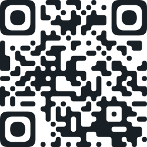
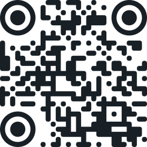
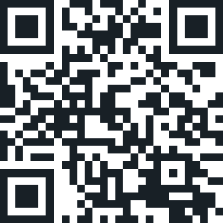

# Sexy-QR

Sexy SVG QR-code generator

[ >> [Online demo](https://avin.github.io/sexy-qr) << ]

## Install

```sh
npm install sexy-qr
```

## API

### `QRCode`

#### Options

| Field     | Type                    | Description      |
| --------- | ----------------------- | ---------------- |
| `content` | `string`                | QR encoded value |
| `ecl`     | `'L' / 'M' / 'Q' / 'H'` | Error correction |

#### Properties:

| Property | Description         |
| -------- | ------------------- |
| `matrix` | Matrix array        |
| `size`   | Side size of matrix |

#### Methods:

| Method        | Values              | Description             |
| ------------- | ------------------- | ----------------------- |
| `emptyCenter` | (emptySize: number) | Remove points in center |

### `QRSvg`

#### Options

| Field                     | Type              | Description                               |
| ------------------------- | ----------------- | ----------------------------------------- |
| `fill`                    | `string`          | SVG fill color                            |
| `size`                    | `number`          | Size of SVG in px                         |
| `radiusFactor`            | `number`          | Factor of points corner radius (0-1)      |
| `cornerBlockRadiusFactor` | `number`          | Factor of big squares corner radius (0-3) |
| `cornerBlocksAsCircles`   | `boolean`         | Draw big corner squares as circles        |
| `roundOuterCorners`       | `boolean`         | Round outer corners                       |
| `roundInnerCorners`       | `boolean`         | Round inner corners                       |
| `preContent`              | `string` / `func` | Pre content of SVG code                   |
| `postContent`             | `string` / `func` | Post content of SVG code                  |

#### Properties

| Property    | Description               |
| ----------- | ------------------------- |
| `svg`       | Result SVG code           |
| `paths`     | Array of path-strings     |
| `pointSize` | Side size of one qr point |

## Usage

```js
import { QRCode, QRSvg } from 'sexy-qr';

const svgCode = (() => {
  const qrCode = new QRCode({
    content: 'https://avin.github.io/sexy-qr',
    ecl: 'M', // 'L' | 'M' | 'Q' | 'H'
  });

  const qrSvg = new QRSvg(qrCode, {
    fill: '#182026',
    cornerBlocksAsCircles: true,
    size: 380, // px
    radiusFactor: 0.75, // 0-1
    cornerBlockRadiusFactor: 2, // 0-3
    roundOuterCorners: true,
    roundInnerCorners: true,
    preContent: '<!-- QR Code -->',
  });

  return qrSvg.svg;
})();
```

## Demo

| Example 1                                                      | Example 2                                                      | Example 3                                                      | Example 4                                                      |
| -------------------------------------------------------------- | -------------------------------------------------------------- | -------------------------------------------------------------- | -------------------------------------------------------------- |
| [](https://avin.github.io/sexy-qr) | [](https://avin.github.io/sexy-qr) | [](https://avin.github.io/sexy-qr) | [](https://avin.github.io/sexy-qr) |

## License

MIT © [avin](https://github.com/avin)
