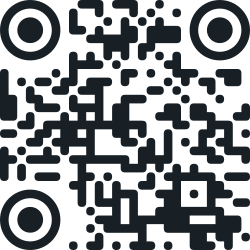

# Sexy-QR

Sexy SVG QR-code generator

[ >> [Online demo](https://avin.github.io/sexy-qr) << ]

## Install

```sh
npm install sexy-qr
```

## API

### `QRCode`

#### Options

| Field     | Type                    | Description      |
| --------- | ----------------------- | ---------------- |
| `content` | `string`                | QR encoded value |
| `ecl`     | `'L' / 'M' / 'Q' / 'H'` | Error correction |

#### Properties:

| Property | Description         |
| -------- | ------------------- |
| `matrix` | Matrix array        |
| `size`   | Side size of matrix |

#### Methods:

| Method        | Values                                      | Description             |
| ------------- | ------------------------------------------- | ----------------------- |
| `emptyCenter` | (emptySize: number, emptySizeHeight?: number) | Remove points in center |

### `QRSvg`

#### Options

| Field                                | Type              | Description                                     |
| ------------------------------------ | ----------------- | ----------------------------------------------- |
| `fill`                               | `string`          | SVG fill color                                  |
| `size`                               | `number`          | Size of SVG in px                               |
| `outerCornerRadius`                  | `number`          | Radius of convex corners, in QR-cell diameters  |
| `innerCornerRadius`                  | `number`          | Radius of concave corners, in QR-cell diameters |
| `cornerBlockOuter`                   | `object`          | Radii for the outer ring of each corner block   |
| `cornerBlockOuter.outerCornerRadius` | `number`          | Radius of the ring's convex corners             |
| `cornerBlockOuter.innerCornerRadius` | `number`          | Radius of the ring's concave corners            |
| `cornerBlockInner`                   | `object`          | Radii for the solid center of each corner block |
| `cornerBlockInner.outerCornerRadius` | `number`          | Radius of the center's convex corners           |
| `resolveCornerRadius`                | `function`        | Override the radius of any individual corner    |
| `preContent`                         | `string` / `func` | Pre content of SVG code                         |
| `postContent`                        | `string` / `func` | Post content of SVG code                        |

All radii default to `0`. A radius of `1` fully rounds a one-cell-wide
shape, so an isolated QR cell becomes a circle. Larger values use the same
cell-relative scale: `3` fully rounds a `3 × 3` square. Negative values are
clamped to `0`, and values larger than the local contour permits are clamped
to a full rounding. Non-finite or non-number values throw a `TypeError`.

`resolveCornerRadius` runs for every contour corner. Return a number to
override that corner's radius, or `undefined` to retain `defaultRadius`.
The returned radius uses the same QR-cell-relative scale as the other radius
options.

```js
const qrSvg = new QRSvg(qrCode, {
  size: 380,
  resolveCornerRadius: (cornerCtx) => {
    const isTargetCorner =
      cornerCtx.region === 'cornerBlock' &&
      cornerCtx.block === 'topRight' &&
      cornerCtx.part === 'ring' &&
      cornerCtx.corner === 'bottomLeft';

    if (!isTargetCorner) {
      return cornerCtx.defaultRadius;
    }

    return cornerCtx.contour === 'outer' ? 2 : 1;
  },
});
```

The callback receives:

- `region`: `'data'` or `'cornerBlock'`
- `block`: `'topLeft'`, `'topRight'`, or `'bottomLeft'`
- `part`: `'ring'` or `'center'`
- `contour`: `'outer'` or `'inner'`
- `corner`: `'topLeft'`, `'topRight'`, `'bottomRight'`, or `'bottomLeft'`
- `vertex`: the contour vertex in QR-cell coordinates
- `cell`: the associated QR cell coordinates
- `defaultRadius`: the radius selected by the regular options

#### Properties

| Property    | Description               |
| ----------- | ------------------------- |
| `svg`       | Result SVG code           |
| `paths`     | Array of path-strings     |
| `pointSize` | Side size of one qr point |

## Usage

```js
import { QRCode, QRSvg, QRSvgPresets } from 'sexy-qr';

const svgCode = (() => {
  const qrCode = new QRCode({
    content: 'https://avin.github.io/sexy-qr',
    ecl: 'M', // 'L' | 'M' | 'Q' | 'H'
  });

  const qrSvg = new QRSvg(qrCode, {
    ...QRSvgPresets.roundedWithCircleCornerBlocks,
    size: 380, // px
    fill: '#182026',
    preContent: '<!-- QR Code -->',
  });

  return qrSvg.svg;
})();
```

#### Presets

`QRSvgPresets` provides immutable rounding configurations that can be mixed
into the options object with the spread operator:

```js
const qrSvg = new QRSvg(qrCode, {
  ...QRSvgPresets.circleCornerBlocks,
  size: 380,
  fill: '#182026',
});
```

Available presets:

- `square`
- `rounded`
- `circleCornerBlocks`
- `roundedWithCircleCornerBlocks`

Object spread is shallow. To override one nested preset value while retaining
the others, spread that nested object explicitly:

```js
const preset = QRSvgPresets.circleCornerBlocks;

const qrSvg = new QRSvg(qrCode, {
  ...preset,
  cornerBlockOuter: {
    ...preset.cornerBlockOuter,
    outerCornerRadius: 2,
  },
  size: 380,
});
```

## Demo

| Example 1                                                      | Example 2                                                      | Example 3                                                      | Example 4                                                      |
| -------------------------------------------------------------- | -------------------------------------------------------------- | -------------------------------------------------------------- | -------------------------------------------------------------- |
| [](https://avin.github.io/sexy-qr) | [](https://avin.github.io/sexy-qr) | [](https://avin.github.io/sexy-qr) | [](https://avin.github.io/sexy-qr) |

### Development

The library and React demo use Vite and share one npm workspace:

```sh
npm install
npm run dev
```

Build both packages with:

```sh
npm run build
```

## License

MIT © [avin](https://github.com/avin)
